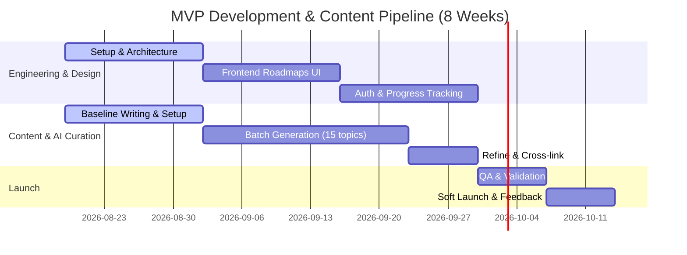

# Master Execution Plan: AI/ML Learning Platform MVP

This plan synthesizes the strategic vision from [AI-ML-Platform-MVP-Strategy.md](file:///Users/abhra/Documents/Epoch/AI-ML-Platform-MVP-Strategy.md) and the operational workflows from [Content-Generation-System.md](file:///Users/abhra/Documents/Epoch/Content-Generation-System.md) into a single, cohesive, week-by-week implementation roadmap.

---

## 1. Executive Summary & Goal
The objective is to launch a structured, curated AI/ML learning platform MVP within **8 weeks** as a solo founder. 
- **Core Value Proposition:** Rather than creating a resource index or generating endless textbooks, the platform provides *the structured path* through existing high-quality resources, supplemented by 15–20 high-quality, AI-assisted original connector topics.
- **Content Goal:** Build 1 complete learning path (e.g., *ML Engineer* or *Deep Learning Engineer*) using the **Hybrid AI-Assisted Drafting & Curation Workflow**.

---

## 2. MVP Scope (V1) vs. Future Phases

### What Ships in V1 (MVP)
*   **Curated Learning Path (Launch with 1):**
    *   5–8 core sequential modules.
    *   2–3 milestone projects (external requirements + checklists).
    *   Visual DAG showing prerequisite mappings.
    *   3 curated resources per module (Conceptual, Deep Dive, Implementation).
*   **Curated Notes:**
    *   15–20 external resource curations with structured metadata (difficulty, duration, key concepts, context).
    *   5–10 original summary connector notes.
*   **Progress Tracking:**
    *   User authentication (Firebase or similar).
    *   Marking modules/resources as complete.
    *   Roadmap recommendations ("What's next?").
*   **Basic Discovery:**
    *   Search modules by keyword.
    *   Filter by difficulty & time to complete.

### Deferred to V2+
*   **V2 (Months 3–4):** LLM & CV Roadmaps, interactive hyperparameter tuning simulators, community feedback/comments.
*   **V3 (Months 5–6):** Context-aware Claude-powered AI tutor agent, interview preparation question bank.
*   **V4 (Months 7–12):** Research hub, premium tier monetisation, advanced end-to-end projects.

---

## 3. Technology Stack

| Layer | Technology Choice | Rationale |
| :--- | :--- | :--- |
| **Frontend** | React / Next.js (TypeScript) | Fast routing, SEO-friendly, quick UI component compilation. |
| **Styling** | Tailwind CSS | Rapid layout design over custom CSS. |
| **Backend** | Python (FastAPI) or Node.js | Fast JSON API delivery. |
| **Database** | PostgreSQL | Robust relation mapping for user progress and roadmaps. |
| **Auth** | Firebase Auth or NextAuth.js | Zero-overhead secure setup. |
| **Content** | File-based Markdown + JSON | Git-versioned, fast to read/write, ready for Headless CMS migration later. |
| **AI Drafts**| Claude API (via `anthropic` SDK) | Premium quality output for technical/mathematical explanations. |

---

## 4. Weekly Timeline (Hybrid Strategy)



### Week 1-2: Setup, Design & Baseline Content
*   **Engineering:**
    *   Initialize Next.js starter repository with TypeScript and Tailwind CSS.
    *   Design the content schema (JSON structures for `topics.json`, `roadmaps.json`, and `resources.json`).
    *   Create static UI wireframes or mockups of the path comparison and modular path progression view.
*   **Content & AI Setup:**
    *   Pick the launch roadmap (e.g., *ML Engineer*).
    *   Write 2–3 topics manually (e.g., *Simple Linear Regression*) to establish a quality baseline.
    *   Configure Claude API credentials and test the **Master Content Generation Prompt** to ensure drafts match the baseline quality.

### Week 3-4: Batch Generation (Part 1) & Roadmap UI
*   **Engineering:**
    *   Build the frontend DAG layout/visual path flow.
    *   Implement user registration/authentication.
*   **Content & AI Setup:**
    *   Run batch processing for the first 10–12 topics.
    *   Spend 30 minutes editing and checking the math for each generated topic.
    *   Map 10–15 external resources (textbooks, videos, Papers with Code) for module links.

### Week 5-6: Batch Generation (Part 2) & Tracking Logic
*   **Engineering:**
    *   Implement backend APIs to record module and resource completions.
    *   Create search and filter widgets.
*   **Content & AI Setup:**
    *   Generate and edit the remaining 10–15 topics.
    *   Write original summary "connector notes" to bridge complex topics together.
    *   Perform a quick user feedback test with 5–10 friends to review the flow of early modules.

### Week 7: Refinement & Cross-linking
*   **Engineering:**
    *   Polish responsive layouts, load states, and dark mode visuals.
*   **Content & AI Setup:**
    *   Verify all LaTeX equations and compile external project milestone files.
    *   Cross-link prerequisites and build next-topic recommendations.

### Week 8: Quality Assurance & Soft Launch
*   **Engineering & QA:**
    *   Perform end-to-end sign-up and progress-tracking checks.
    *   Deploy frontend to Vercel and backend to Railway/Render.
*   **Content QA:**
    *   Apply the content checklist (math verification, Reproducible Worked Examples, jargon definitions).
*   **Marketing & GTM:**
    *   Launch to 100–500 early users via Twitter/X, r/learnmachinelearning, and AI Discord channels.

---

## 5. Content Operations & Quality Control

To maintain a premium product that feels educational rather than AI-generated, every topic must pass the following QA gates.

### The Edit Routine (30 Minutes / Topic)
1.  **Pedagogy Scan (5 min):** Ensure concepts are explained visually and intuitively *before* the math notation appears.
2.  **Math Verification (10 min):** Manually step through the calculations in **Worked Example 1 & 2** (numbers must be small and reproducible by hand).
3.  **Clarity Optimization (10 min):** Simplify sentences, verify that jargon is defined, and check tone consistency.
4.  **Formatting Check (5 min):** Validate LaTeX tags, table alignments, and warning formatting.

### File Structure mapping
```
/content
  ├── /topics             # Markdown generated & edited topics (e.g. gradient-descent.md)
  ├── /metadata           
  │     ├── topics.json   # Definitions, prerequisites, outcomes
  │     └── roadmaps.json # Sequenced list of topic IDs per roadmap
  └── /resources          # Curated external resources (MIT, OCW, fast.ai, etc.)
```

---

## 6. Success Metrics & Targets (First 60 Days)

| Metric | Target | Purpose |
| :--- | :--- | :--- |
| **Signups** | 500+ | Validate user demand and initial interest. |
| **Weekly Active Users (WAU)** | 50+ | Assess core engagement and roadmap utility. |
| **Module Completion Rate** | 20% of users complete 3+ modules | Direct signal of product-market fit. |
| **Retention Rate** | 30%+ Week-over-Week | Evaluate stickiness of learning paths. |
| **Curation Quality Feedback** | 90%+ positive rating | Content accuracy check. |

---

## 7. Key Risks & Mitigations

*   **Risk: AI draft quality is dry or hallucinated.**
    *   *Mitigation:* Never publish unedited drafts. Keep the prompt bounded and focus manual effort on verifying math and introducing conversational language.
*   **Risk: Scope creep (trying to include coding playgrounds/AI tutor at launch).**
    *   *Mitigation:* Enforce strict roadmap gates. Defer all complex interactivity to V3. The V1 win is **curation and structured paths**, not original sandbox code execution.
*   **Risk: Solo Burnout.**
    *   *Mitigation:* Limit batch generation to 5–6 topics per week, and use the Hybrid timeline option to spread content editing tasks evenly.
